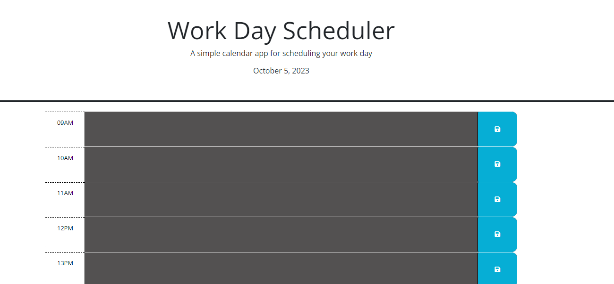

# myWorkDay
A work-day scheduling system to assign projects to each hour.
# myWorkDay
A work-day scheduling system to assign projects to each hour.

## Description

Have a busy day? Struggle with knowing which task to do next? Feeling overwhelmed by a daily planner?

Check out this HOURLY work tracker! 

## Installation

No installation OR sign-in required. Simply follow this link: [click here](https://kathrynfisher3700.github.io/myWorkDay/)

## Usage

When the page loads you'll see today's date at the top, then hourly blocks from 9am - 5pm.
Hours that have passed will show 🔲Gray, the current hour will show 🟥RED, and future hours will show 🟩GREEN.

## Credits

HTML, CSS and parameters provided by UCF Coding Bootcamp.

Special thanks to my classmate Jared in the UCF Coding Bootcamp.

Day.js instructions can be found here: [day.js.org](https://day.js.org/docs/en/display/format)

## Improvements

It is my goal to add the following:

-local storage set and get for information typed into each hour block.

